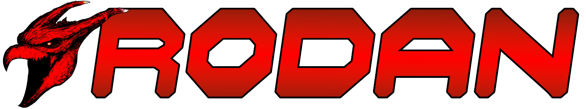

<p align="center">
    <br>
    <b>A high performance CTF platform.</b>
    <br><br>
</p>

## **Table of contents**
- [Introduction](#Introduction)
- [Key Features](#Key-Features)
- [Installation](#Installation)
- [Getting Started](#Getting-Started)
- [Documentation](#Documentation)
- [Index](#Index)
- [Contributing](#Contributing)
- [License](#License)

## **Introduction**
Rodan is a highly performant CTF platform, mainly written in Go.

## **Key Features**
- **Easy Setup** 
- **Asynchronous**  
- **Heavily Tested**
- **Modular**

## **Installation**
```sh
docker compose up -d
```

## **Getting Started**
TO-BE-DONE

## **Documentation**
Documentations can be found at [pkg.go.dev](https://pkg.go.dev).

## **Index**
- [Rodan-Core](https://github.com/intraware/rodan-core)
- [Rodan-Authify](https://github.com/intraware/rodan-authify)
- [Rodan-SSE](https://github.com/intraware/rodan-sse)
- [Rodan-FileServer](https://github.com/intraware/rodan-fileserver)

## **Contributing**
Pull requests are welcome. For major changes, please open an issue first to discuss what you would like to change.

Please make sure to update examples as appropriate.


## **License**
[](https://opensource.org/licenses/MIT)
<br>Licensed Under <a href="https://opensource.org/licenses/MIT">The MIT License</a>
